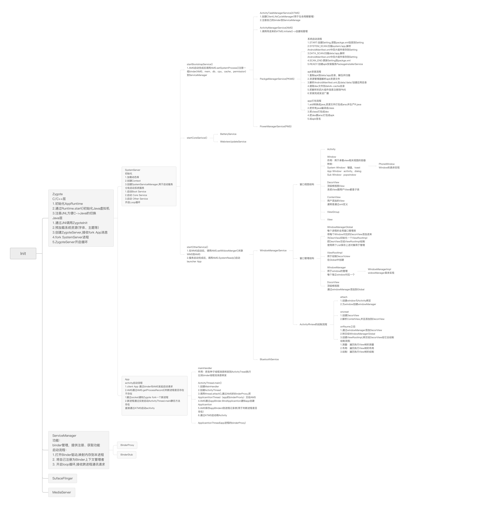
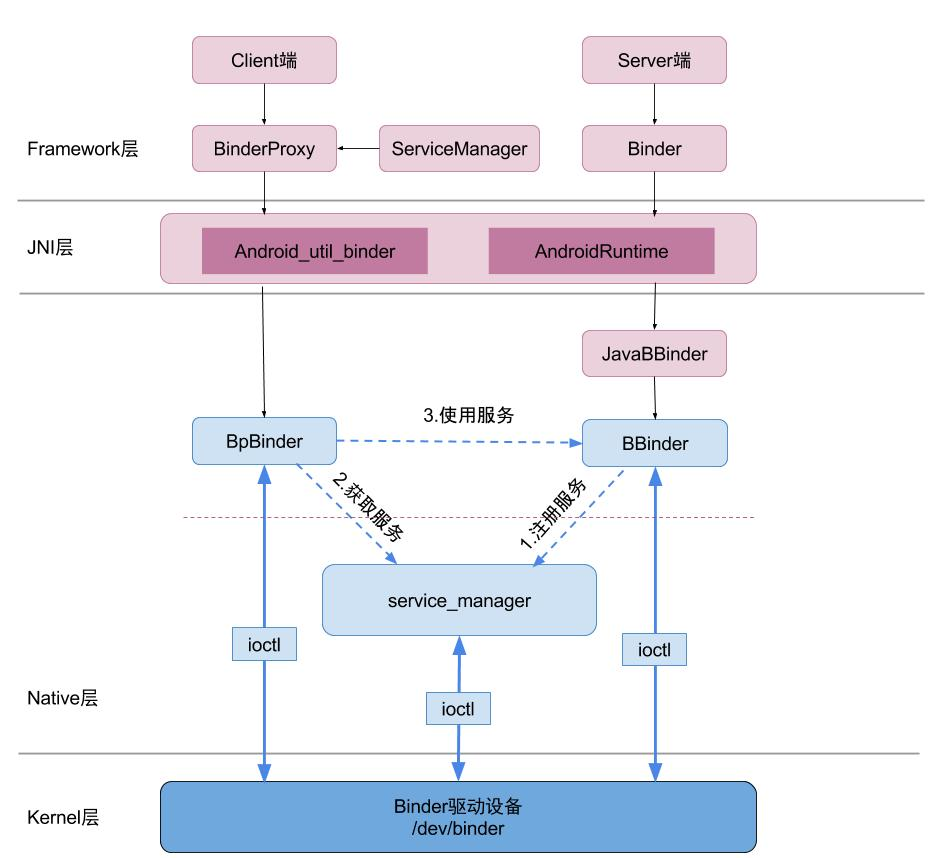
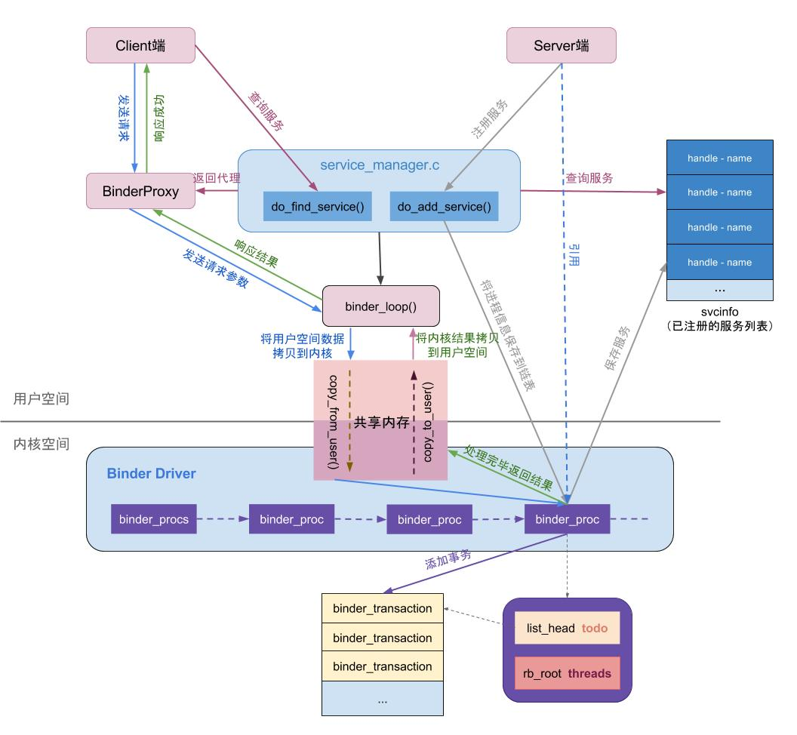
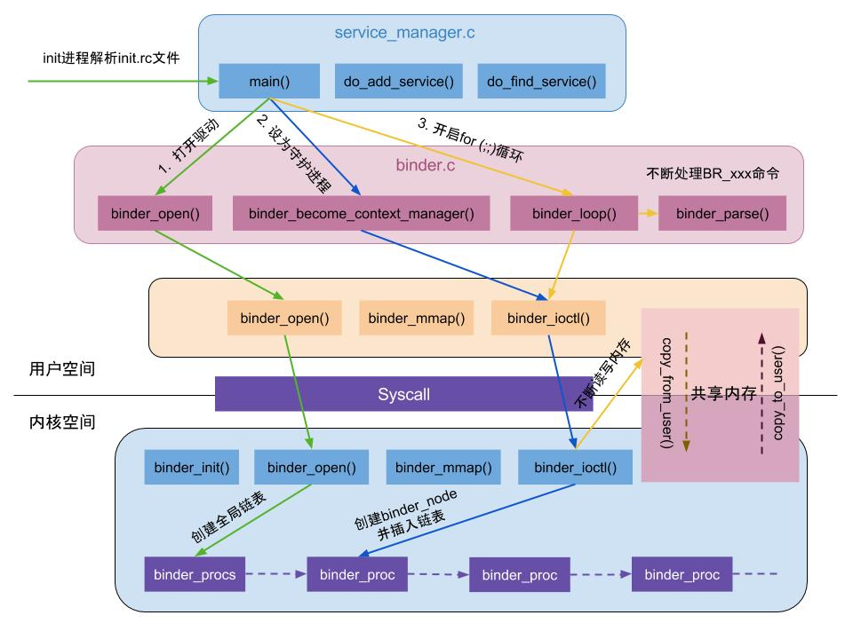
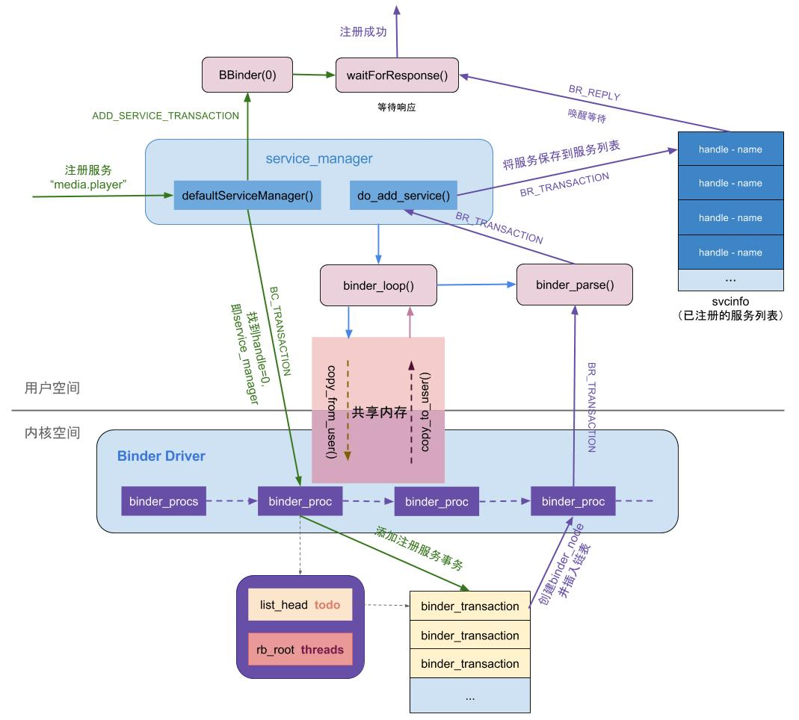
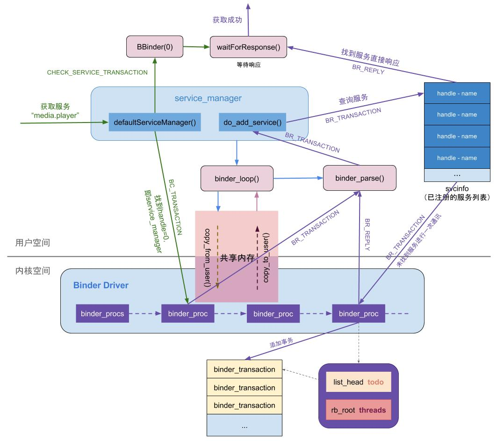

# Framework笔记

## Handler

### 待总结

### 参考资料

1. [android源码学习-Handler机制及其六个核心点](https://blog.csdn.net/rzleilei/article/details/123187510)

## Binder

### 跨进程通讯实现方式

- Android:
    - intent+bundle(activity、Service、Broadcast之间启动传参,底层基于binder)
    - ContentProvider(跨进程数据共享,主要用于CRUD,底层基于binder)
    - AIDL(主要用于Service通讯,基于binder)
- Linux:
    - 管道(半双工,单向)
    - socket(全双工,双向)
    - 信号(单向)
    - 共享内存(效率高,0拷贝,需要处理并发问题)

### 跨进程通讯方式对比

- 共享内存(0次拷贝,有并发问题)
- Binder(1次拷贝,基于C/S架构,实现复杂)
- socket、管道(2次拷贝,C/S架构,使用简单)

### AIDL

- 使用
    - 服务端新建AIDL文件
    - build或编译生产对应的java文件,文件中自动生成了stub类与定义的方法
    - 新建Service,返回BinderStub抽象类并实现其方法
    - 拷贝带路径的服务端AIDL文件到客户端
    - 在客户端绑定服务并且获得BinderProxy,通过Proxy调用方法
- 参数为对象时注意事项
    - 对象参数必须实现Parcelable接口
    - 对象参数需要in(C->S单向流通),out(C<-S单向),inout(C<->S双向流通)三个当中的其中一个修饰符
    - 需要新建一个对象.aidl,在其中声明对象为parcelable
    - 在使用到对象参数的aidl文件导入对象类

### binder理解

- binder架构
  
- binder机制
  
- ServiceManage启动
  
- ServiceManage注册服务
  
- ServiceManage获取服务
  

### 参考资料

1. [一篇文章了解相见恨晚的 Android Binder 进程间通讯机制](https://blog.csdn.net/freekiteyu/article/details/70082302)

## Zygote

## AMS

## WMS

## PMS

